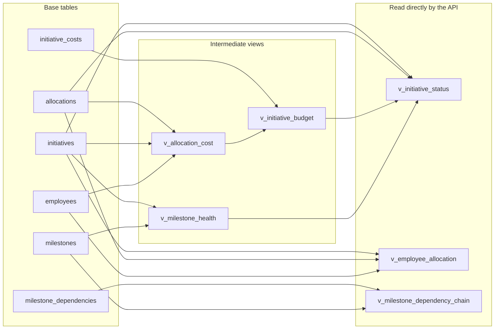

# Data Layer — Initiative Delivery Tracker

PostgreSQL schema and reporting views for the ACME Inc. initiative delivery
tracker. Both files are idempotent and were verified against a live
PostgreSQL 17 instance before commit.

| File                             | Contents                                              |
| -------------------------------- | ----------------------------------------------------- |
| [`schema.sql`](./schema.sql)     | Tables, constraints, triggers, extensions              |
| [`views.sql`](./views.sql)       | Reporting views — one per business question            |

Apply in that order. `schema.sql` runs inside a single transaction; `views.sql`
uses `CREATE OR REPLACE` throughout and is safe to re-run on its own whenever a
view changes.

---

## Domain model

The model deliberately describes **initiatives**, not projects. There are no
tasks, work items, or timesheets anywhere in the schema. Two consequences drive
almost every design decision below:

- People are committed to initiatives by **percentage over a date range**, never
  by assigned task.
- Deliverables are **milestones** — prototype finished, beta test, QA signed
  off, rollout — not task lists.

| Table                    | Purpose                                                  |
| ------------------------ | -------------------------------------------------------- |
| `app_users`              | Authentication; role is `ADMIN`, `PROJECT_MANAGER`, `TEAM_LEAD`, or `VIEWER` |
| `employees`              | Resources — weekly capacity in hours plus a cost rate     |
| `initiatives`            | Funded bodies of work, each with a planned budget         |
| `milestones`             | Deliverable checkpoints belonging to one initiative       |
| `milestone_dependencies` | Self-referencing edge table (stretch goal)                |
| `allocations`            | Employee ↔ initiative at a percentage over a date range   |
| `initiative_costs`       | Non-labour spend — hardware, licences, travel (stretch)   |

### Entity relationships


`milestone_dependencies` carries two foreign keys back to `milestones` — one for
the blocked milestone, one for its prerequisite. Mermaid can only draw one edge
per pair, so read the single line as both.

---

## Enforcing the 40-hour rule

> An employee may never exceed 100% commitment **at any point in time**.

This is the single hardest constraint in the schema, and it cannot be expressed
declaratively:

- A row-level `CHECK` cannot see other rows.
- An `EXCLUSION` constraint can detect overlap but cannot `SUM`.

So it is a **constraint trigger**, `enforce_allocation_capacity()`.

### Why it is cheap

Total allocation over time is a *step function* — it only changes on days where
an allocation starts or ends. The peak therefore always lands on a day some
allocation **starts**. The trigger probes only the start dates of overlapping
allocations rather than scanning day by day.

```
Employee capacity timeline
100% ┤     ┌───────────┬───────────┐
     │     │  CC-2026  │           │
 60% ┤     │   (60%)   │ MOB-2026  │
     │     ├───────────┤   (100%)  │
 40% ┤     │ ATM-2026  │           │
     │     │   (40%)   │           │
  0% ┴─────┴───────────┴───────────┴────────►
       Jan-01        Jul-01      Dec-31
             ▲             ▲
             └── probe     └── probe

  Two dates are checked, not 365.
```

### Two implementation details that are easy to get wrong

**It fires `AFTER`, not `BEFORE`.** Generated columns such as `period` are not
yet populated during `BEFORE` triggers, so `NEW.period` would be `NULL`.

**It is `DEFERRABLE`.** A bulk import that temporarily passes through an
invalid intermediate state can `SET CONSTRAINTS allocations_capacity_check
DEFERRED` and settle at `COMMIT`.

A generated `period daterange` column backs both the trigger and a GiST index on
`(employee_id, period)`, so the overlap test and the index share one definition
and cannot drift apart.

### Verified behaviour

| Scenario                                | Expected  | Result                          |
| --------------------------------------- | --------- | ------------------------------- |
| 60% + 40% overlapping                   | accept    | accepted at exactly 100%        |
| +20% more overlapping                   | reject    | peak 120% on 2026-03-01         |
| 100% in a **non-overlapping** window    | accept    | accepted                        |
| `UPDATE` 60% → 70%                      | reject    | peak 110% on 2026-01-01         |
| open-ended allocation colliding later   | reject    | peak 110% on 2026-08-01         |

The third row is the important one. Sequential staffing — full time on one
initiative, then full time on the next — is legitimate and must not be blocked.
A naive `SUM(allocation_percent) GROUP BY employee_id` rejects it incorrectly.

---

## Reporting views

One view per business question in the brief.

| View                           | Answers                                                |
| ------------------------------ | ------------------------------------------------------ |
| `v_milestone_health`           | What are the key deliverables and their status?         |
| `v_allocation_cost`            | *(building block)* per-allocation elapsed vs committed weeks |
| `v_initiative_budget`          | How much budget is consumed versus planned?             |
| `v_initiative_status`          | What is each initiative's status? Which are at risk?    |
| `v_employee_allocation`        | How are resources allocated? Who is over-allocated?     |
| `v_milestone_dependency_chain` | What is the dependency chain between deliverables?      |

### How the views compose



`v_allocation_cost` and `v_milestone_health` exist to be composed into the
others; the three views in the right-hand group are what the API should query.

### Budget: consumed versus committed

`v_initiative_budget` reports both:

- **`total_consumed`** — labour for weeks that have actually elapsed, plus
  incurred non-labour costs.
- **`total_committed`** — labour across the *full* allocation window.

`forecast_overrun` derives from the second, so a project manager sees an overrun
coming rather than discovering it afterwards. Labour cost is
`allocation_percent × weekly_capacity_hours × hourly_rate × weeks`, defaulting to
$100/hr per the brief but stored per-employee so a rate change needs no
migration.

### Dependency chains

`v_milestone_dependency_chain` uses `WITH RECURSIVE ... CYCLE`. A bad edge
returns `is_cycle = true` with the offending path instead of hanging the query —
which matters because this view sits behind an HTTP endpoint. `path_labels`
renders the readable chain, e.g.
`Credit card changes -> ATM firmware -> ATM rollout`.

---

## Testing

Requires a local PostgreSQL. Credentials match
[`bin/setup-environment.sh`](../bin/setup-environment.sh).

```bash
export PGPASSWORD=postgres123
cd ~/coding-workshop-participant

psql -h localhost -U postgres \
  -c "DROP DATABASE IF EXISTS schema_check;" \
  -c "CREATE DATABASE schema_check;"

psql -h localhost -U postgres -d schema_check -v ON_ERROR_STOP=1 -f data/schema.sql
psql -h localhost -U postgres -d schema_check -v ON_ERROR_STOP=1 -f data/views.sql
```

Then run the capacity fixture. **Omit `ON_ERROR_STOP` here** — three of the five
cases are *supposed* to raise, and `ON_ERROR_STOP` would halt at the first one.
Each statement runs in its own implicit transaction, so failures roll back
individually and the passing rows survive.

```bash
psql -h localhost -U postgres -d schema_check -f /tmp/capacity_tests.sql
```

Passing output shows `Over-allocation:` exceptions for cases 2, 4 and 5, each
naming the peak percentage and the date it occurs, with three allocation rows
surviving.

Clean up with:

```bash
psql -h localhost -U postgres -c "DROP DATABASE schema_check;"
```

---

## Notes and gotchas

**Extensions.** `citext` (case-insensitive email) and `btree_gist` (lets a GiST
index mix the scalar `employee_id` with the `period` range). Both are created by
`schema.sql` and both are available on Aurora PostgreSQL.

**Identity ids are not contiguous.** `GENERATED ALWAYS AS IDENTITY` is backed by
a sequence, and sequences are non-transactional by design — `nextval()` is
consumed before the trigger runs, and a rollback does not return it. A rejected
insert therefore burns an id permanently, which is why the capacity fixture ends
with ids 1, 2 and 4. This is deliberate on PostgreSQL's part: rolling sequences
back would serialise every concurrent insert.

> Never show these ids to users as "record #N", and never assume they are
> gapless. If gapless numbering is ever required, it needs a separate counter
> table with row locking — not an identity column.

**`over_allocated` is a safety net, not a routine condition.** The capacity
trigger makes >100% impossible to insert, so
`v_employee_allocation.over_allocated` is normally always false. It exists to
catch rows admitted while the deferrable constraint was deferred. The column's
day-to-day value is `available_hours_per_week` and the `FULLY_ALLOCATED` vs
`HAS_CAPACITY` distinction.

**Two views are date-dependent.** `v_initiative_status` and
`v_employee_allocation` filter on `period @> current_date`, so their output
changes as time passes — an employee split 60/40 in March may show as 100% on a
single initiative in July. Correct behaviour, but any CI test over them must pin
dates relative to `current_date` rather than asserting fixed values.
