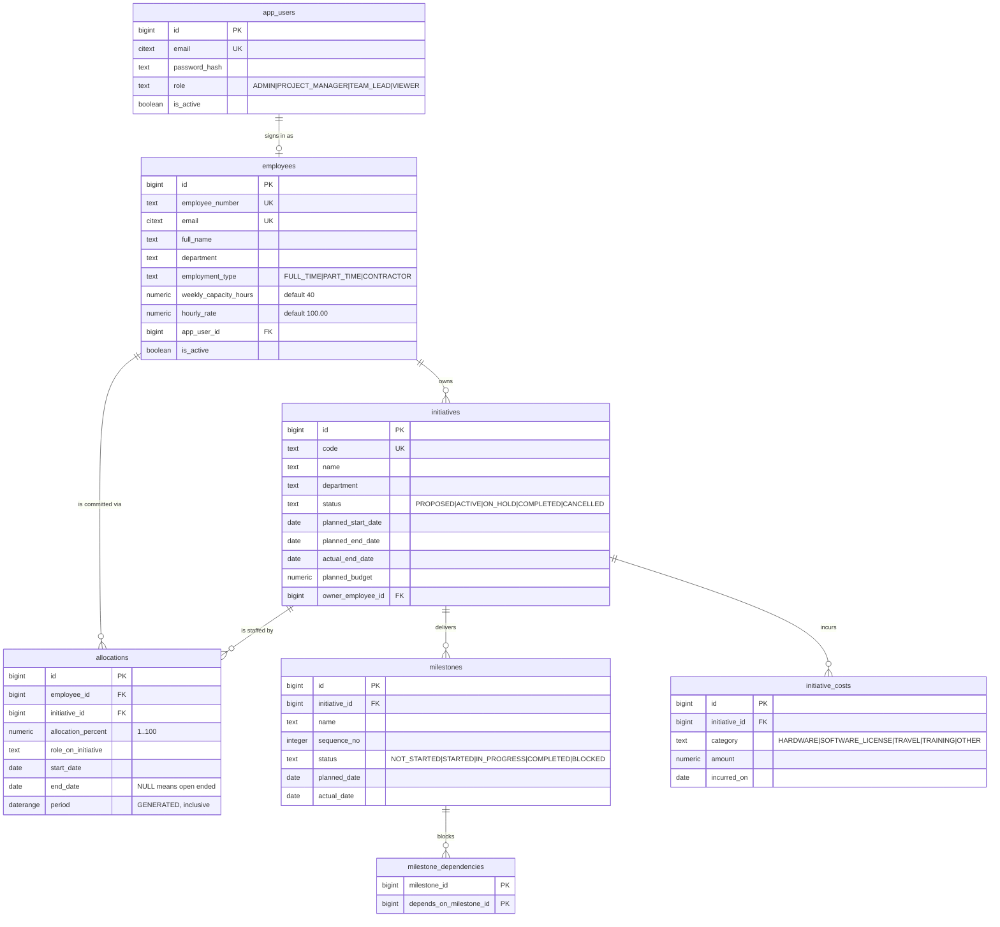
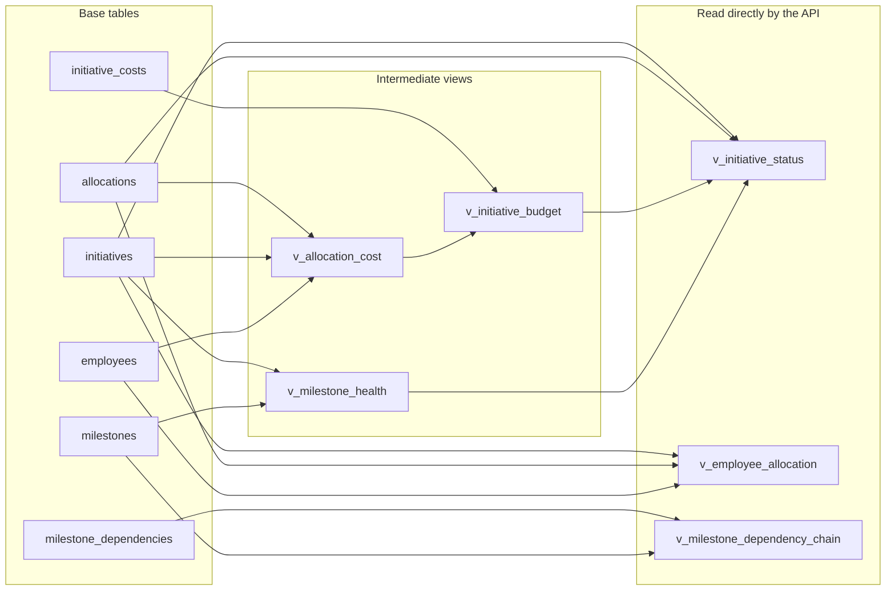

# Data Layer — Initiative Delivery Tracker

PostgreSQL schema and reporting views for the ACME Inc. initiative delivery
tracker. Both files are idempotent and were verified against a live
PostgreSQL 17 instance before commit.

| File                             | Contents                                              |
| -------------------------------- | ----------------------------------------------------- |
| [`schema.sql`](./schema.sql)     | Tables, constraints, triggers, extensions              |
| [`views.sql`](./views.sql)       | Reporting views — one per business question            |

Apply in that order. `schema.sql` runs inside a single transaction; `views.sql`
uses `CREATE OR REPLACE` throughout and is safe to re-run on its own whenever a
view changes.

---

## Database choice: PostgreSQL, not MongoDB

The workshop environment ships **both** databases, so this was a real decision
rather than a default. It went to PostgreSQL, and this section records why and
what the unused MongoDB path consists of.

### What the environment provides for MongoDB

None of the following was set up by this project — it is all workshop
scaffolding that was present before any application code was written:

| Piece | Where | State |
| ----- | ----- | ----- |
| Local `mongod` (8.0) | `localhost:27017` | **Running.** Installed and enabled by `install_mongodb()` in [`bin/setup-environment.sh`](../bin/setup-environment.sh), alongside PostgreSQL |
| `mongosh` / `mongod` binaries | `/usr/bin` | Installed |
| AWS DocumentDB (Mongo-compatible) | [`infra/documentdb.tf`](../infra/documentdb.tf) | **Not provisioned.** Every resource is gated on `var.aws_mongo_enabled`, which defaults to `false` |
| Connection helpers | `backend/_examples/{python,nodejs,java}-service/` | Example `mongo_service` modules with pooled clients |
| Environment variables | `MONGO_HOST`, `MONGO_PORT`, `MONGO_NAME`, `MONGO_USER`, `MONGO_PASS` | Injected automatically, empty unless enabled |

So MongoDB is *available locally and unconfigured in the cloud*. The asymmetry
matters: [`docs/full-stack.md`](../docs/full-stack.md) notes it "comes
pre-installed locally, although not in the cloud."

### How it would be enabled

Enabling is a Terraform variable, not a code change. Per the full-stack guide:

```sh
echo "export TF_VAR_aws_mongo_enabled=true" >> ~/.bashrc
source ~/.bashrc
./bin/deploy-backend.sh
```

That flips the `count` on the DocumentDB cluster, subnet group and instance, and
subsequent deploys provision them. Application code would then connect through
`MONGO_*` rather than `POSTGRES_*`, with two differences from local: TLS is
required (`tls=True`, `tlsAllowInvalidCertificates=True`) and retryable writes
must be disabled (`retryWrites=False`), neither of which applies to the local
instance.

### Why PostgreSQL was chosen instead

Three reasons, in descending order of weight:

**The domain is relational, and the hard questions are joins.** The two most
valuable queries in the brief are aggregations across entities. "Who is
over-allocated" is a sum over a many-to-many with an attribute; "budget consumed
versus planned" joins allocations to employees to initiatives. The milestone
dependency chain is a recursive graph walk, which `WITH RECURSIVE ... CYCLE`
does natively and which is precisely the shape a document store handles worst.

**The 40-hour rule needs a real constraint.** The capacity rule described below
is enforced by a deferrable constraint trigger inside the database, so it holds
no matter which service writes. There is no equivalent transactional guarantee
available for a cross-document invariant in DocumentDB.

**Cloud support is asymmetric.** PostgreSQL is provisioned by default;
DocumentDB is not. Choosing MongoDB would have meant enabling infrastructure,
re-running Terraform, and handling the TLS differences — cost with no
corresponding benefit, since none of the entities need schema flexibility.

The requirements also name PostgreSQL explicitly, and the full-stack guide calls
it "the recommended database option."

---

## How PostgreSQL is provisioned

There are two environments, provisioned by completely different mechanisms, and
the application code is written not to care which it is talking to.

### Local

The server itself is **not** provisioned by this project.
[`bin/setup-environment.sh`](../bin/setup-environment.sh) installs PostgreSQL
(pinned to major version 18 via `POSTGRES_VERSION`), starts it on
`localhost:5432`, and sets the `postgres` superuser password to `postgres123`.
That runs once, as part of workshop environment setup.

What this project adds is the database contents. Apply them to the **`postgres`**
database — not a new one:

```sh
export PGPASSWORD=postgres123
psql -h localhost -U postgres -d postgres -v ON_ERROR_STOP=1 -f data/schema.sql
psql -h localhost -U postgres -d postgres -v ON_ERROR_STOP=1 -f data/views.sql
```

The database name is not a free choice locally. Terraform hardcodes
`POSTGRES_NAME = "postgres"` for LocalStack (see the table below), so a schema
applied to any other database is invisible to the running Lambda — `psql` and
local tests find it, the deployed function does not.

`ON_ERROR_STOP=1` matters here — without it `psql` continues past a failed
statement and reports success while leaving a half-built schema behind.

### Cloud

[`infra/rds.tf`](../infra/rds.tf) declares an **Aurora PostgreSQL Serverless v2**
cluster. It is created by default: every resource is gated on
`var.aws_postgres_enabled`, which defaults to `true` in
[`infra/variable.tf`](../infra/variable.tf) — the mirror image of the DocumentDB
gate above.

| Setting | Value |
| ------- | ----- |
| Engine | `aurora-postgresql` 17.7 |
| Instance class | `db.serverless` |
| Capacity | 0.0–4.0 ACU (scales to zero when idle) |
| Database name | `codingworkshop` (project name, hyphens stripped) |
| Master user | `superadmin` |
| Master password | Generated by `random_pet` |
| Encryption | Storage encrypted |
| Backups | 7-day retention, 07:00–09:00 window |
| Logs | `postgresql` exported to CloudWatch |

> **Version skew.** Local is PostgreSQL 18; Aurora is pinned to 17.7. Nothing in
> this schema requires 18 — `WITH RECURSIVE ... CYCLE` is 14+, generated columns
> are 12+ — so both work. But local is not a perfect rehearsal for deployed.

### How connection details reach the code

No credentials are hardcoded and none are committed. Terraform composes the
`POSTGRES_*` environment variables in [`infra/locals.tf`](../infra/locals.tf) and
injects them into every Lambda. The switch is the AWS account id: LocalStack
reports `000000000000`, real AWS does not.

| Variable | Local (LocalStack) | Cloud |
| -------- | ------------------ | ----- |
| `IS_LOCAL` | `true` | `false` |
| `POSTGRES_HOST` | `172.17.0.1` (Docker bridge to the host) | Aurora cluster endpoint |
| `POSTGRES_PORT` | `5432` | Cluster port |
| `POSTGRES_NAME` | `postgres` | `codingworkshop` |
| `POSTGRES_USER` | `postgres` | `superadmin` |
| `POSTGRES_PASS` | `postgres123` | Generated cluster password |

[`backend/initiatives/db.py`](../backend/initiatives/db.py) reads these and uses
`IS_LOCAL` for the one behavioural difference that matters: Aurora requires SSL
(`sslmode=require`), the local server does not offer it (`sslmode=prefer`).

### Two gaps to be aware of

**Nothing applies `schema.sql` to Aurora.** [`bin/deploy-backend.sh`](../bin/deploy-backend.sh)
ships Lambda code only, and every `psql` reference under `bin/` concerns the
*local* install. A deploy therefore produces working Lambdas pointed at an empty
database, and every endpoint fails on a missing table. Applying the schema to
Aurora is a manual step — or wants a migration job — and it has not been done.

**The local Lambda's database name is fixed to `postgres`.** `POSTGRES_NAME` is
hardcoded for LocalStack and is not configurable per project, which is why the
setup above targets `postgres` directly. Creating a purpose-named database such
as `acme_dev` looks tidier and silently breaks the deployed function: `psql` and
local tests read the new database while the Lambda keeps reading `postgres`.
Cloud is unaffected — there the name comes from the Aurora cluster
(`codingworkshop`).

---

## Domain model

The model deliberately describes **initiatives**, not projects. There are no
tasks, work items, or timesheets anywhere in the schema. Two consequences drive
almost every design decision below:

- People are committed to initiatives by **percentage over a date range**, never
  by assigned task.
- Deliverables are **milestones** — prototype finished, beta test, QA signed
  off, rollout — not task lists.

| Table                    | Purpose                                                  |
| ------------------------ | -------------------------------------------------------- |
| `app_users`              | Authentication; role is `ADMIN`, `PROJECT_MANAGER`, `TEAM_LEAD`, or `VIEWER` |
| `employees`              | Resources — weekly capacity in hours plus a cost rate     |
| `initiatives`            | Funded bodies of work, each with a planned budget         |
| `milestones`             | Deliverable checkpoints belonging to one initiative       |
| `milestone_dependencies` | Self-referencing edge table (stretch goal)                |
| `allocations`            | Employee ↔ initiative at a percentage over a date range   |
| `initiative_costs`       | Non-labour spend — hardware, licences, travel (stretch)   |

### Entity relationships



`milestone_dependencies` carries two foreign keys back to `milestones` — one for
the blocked milestone, one for its prerequisite. Mermaid can only draw one edge
per pair, so read the single line as both.

---

## Enforcing the 40-hour rule

> An employee may never exceed 100% commitment **at any point in time**.

This is the single hardest constraint in the schema, and it cannot be expressed
declaratively:

- A row-level `CHECK` cannot see other rows.
- An `EXCLUSION` constraint can detect overlap but cannot `SUM`.

So it is a **constraint trigger**, `enforce_allocation_capacity()`.

### Why it is cheap

Total allocation over time is a *step function* — it only changes on days where
an allocation starts or ends. The peak therefore always lands on a day some
allocation **starts**. The trigger probes only the start dates of overlapping
allocations rather than scanning day by day.

```
Employee capacity timeline
100% ┤     ┌───────────┬───────────┐
     │     │  CC-2026  │           │
 60% ┤     │   (60%)   │ MOB-2026  │
     │     ├───────────┤   (100%)  │
 40% ┤     │ ATM-2026  │           │
     │     │   (40%)   │           │
  0% ┴─────┴───────────┴───────────┴────────►
       Jan-01        Jul-01      Dec-31
             ▲             ▲
             └── probe     └── probe

  Two dates are checked, not 365.
```

### Two implementation details that are easy to get wrong

**It fires `AFTER`, not `BEFORE`.** Generated columns such as `period` are not
yet populated during `BEFORE` triggers, so `NEW.period` would be `NULL`.

**It is `DEFERRABLE`.** A bulk import that temporarily passes through an
invalid intermediate state can `SET CONSTRAINTS allocations_capacity_check
DEFERRED` and settle at `COMMIT`.

A generated `period daterange` column backs both the trigger and a GiST index on
`(employee_id, period)`, so the overlap test and the index share one definition
and cannot drift apart.

### Verified behaviour

| Scenario                                | Expected  | Result                          |
| --------------------------------------- | --------- | ------------------------------- |
| 60% + 40% overlapping                   | accept    | accepted at exactly 100%        |
| +20% more overlapping                   | reject    | peak 120% on 2026-03-01         |
| 100% in a **non-overlapping** window    | accept    | accepted                        |
| `UPDATE` 60% → 70%                      | reject    | peak 110% on 2026-01-01         |
| open-ended allocation colliding later   | reject    | peak 110% on 2026-08-01         |

The third row is the important one. Sequential staffing — full time on one
initiative, then full time on the next — is legitimate and must not be blocked.
A naive `SUM(allocation_percent) GROUP BY employee_id` rejects it incorrectly.

---

## Reporting views

One view per business question in the brief.

| View                           | Answers                                                |
| ------------------------------ | ------------------------------------------------------ |
| `v_milestone_health`           | What are the key deliverables and their status?         |
| `v_allocation_cost`            | *(building block)* per-allocation elapsed vs committed weeks |
| `v_initiative_budget`          | How much budget is consumed versus planned?             |
| `v_initiative_status`          | What is each initiative's status? Which are at risk?    |
| `v_employee_allocation`        | How are resources allocated? Who is over-allocated?     |
| `v_milestone_dependency_chain` | What is the dependency chain between deliverables?      |

### How the views compose



`v_allocation_cost` and `v_milestone_health` exist to be composed into the
others; the three views in the right-hand group are what the API should query.

### Budget: how "consumed to date" is calculated

Nothing about spend is entered by hand. It is derived entirely from **who is
allocated, at what percentage, for how long** — so budget consumption cannot
drift away from staffing. Adding a person to an initiative immediately moves its
consumed figure.

**The formula, per allocation:**

```
labour = allocation_percent / 100          ← share of that person's week
       × weekly_capacity_hours             ← their week (40 by default)
       × hourly_rate                       ← $100/hr by default
       × elapsed_weeks                     ← weeks worked so far
```

`elapsed_weeks` counts only time that has actually passed. It runs from the
allocation's start to **today or its end date, whichever is earlier**, and is
floored at zero so an allocation starting next month contributes nothing:

```sql
GREATEST((LEAST(COALESCE(end_date, current_date), current_date)
          - start_date + 1) / 7.0, 0)
```

An initiative's total is the sum across its allocations, plus any non-labour
costs already incurred:

```
total_consumed = Σ labour  +  Σ initiative_costs WHERE incurred_on <= today
```

**Worked example — CC-2026 on 22 July 2026:**

Both allocations run 5 Jan → 30 Nov 2026, so 199 days have elapsed
(≈ 28.4286 weeks).

| Person | % | Hours/wk | Rate | Weeks | Labour |
| ------ | -: | -: | -: | -: | -: |
| Dana Reyes | 60 | 40 | $100 | 28.4286 | $68,228.64 |
| Sam Okafor | 100 | 40 | $100 | 28.4286 | $113,714.40 |
| | | | | **Labour** | **$181,943.04** |
| Card tokenisation SDK | | | | **Other** | **$65,000.00** |
| | | | | **Total consumed** | **$246,943.04** |

Against a $900,000 plan that is **27.4%**.

### Consumed versus committed

`v_initiative_budget` reports two different figures, and the distinction matters:

- **`total_consumed`** — weeks that have *elapsed*. What has been spent.
- **`total_committed`** — the *full* allocation window, using
  `committed_weeks` instead. What will be spent if nothing changes.

`forecast_overrun` derives from the second, so a project manager sees an overrun
coming rather than discovering it afterwards. ATM-2026 is the example in the
fixture: committed allocations project past its budget before it ends.

Two consequences worth knowing:

- **An initiative with no allocations reads as $0 spent**, however much it
  actually cost. The `v_employee_allocation` view and the UI both flag this.
- **Rates are stored per employee**, defaulting to the brief's $100/hr flat
  estimate. Differentiating rates later needs no migration, only data.

### Dependency chains

`v_milestone_dependency_chain` uses `WITH RECURSIVE ... CYCLE`. A bad edge
returns `is_cycle = true` with the offending path instead of hanging the query —
which matters because this view sits behind an HTTP endpoint. `path_labels`
renders the readable chain, e.g.
`Credit card changes -> ATM firmware -> ATM rollout`.

---

## Testing

Requires a local PostgreSQL. Credentials match
[`bin/setup-environment.sh`](../bin/setup-environment.sh).

```bash
export PGPASSWORD=postgres123
cd ~/coding-workshop-participant

psql -h localhost -U postgres \
  -c "DROP DATABASE IF EXISTS schema_check;" \
  -c "CREATE DATABASE schema_check;"

psql -h localhost -U postgres -d schema_check -v ON_ERROR_STOP=1 -f data/schema.sql
psql -h localhost -U postgres -d schema_check -v ON_ERROR_STOP=1 -f data/views.sql
```

Then run the capacity fixture. **Omit `ON_ERROR_STOP` here** — three of the five
cases are *supposed* to raise, and `ON_ERROR_STOP` would halt at the first one.
Each statement runs in its own implicit transaction, so failures roll back
individually and the passing rows survive.

```bash
psql -h localhost -U postgres -d schema_check -f /tmp/capacity_tests.sql
```

Passing output shows `Over-allocation:` exceptions for cases 2, 4 and 5, each
naming the peak percentage and the date it occurs, with three allocation rows
surviving.

Clean up with:

```bash
psql -h localhost -U postgres -c "DROP DATABASE schema_check;"
```

---

## Notes and gotchas

**Extensions.** `citext` (case-insensitive email) and `btree_gist` (lets a GiST
index mix the scalar `employee_id` with the `period` range). Both are created by
`schema.sql` and both are available on Aurora PostgreSQL.

**Identity ids are not contiguous.** `GENERATED ALWAYS AS IDENTITY` is backed by
a sequence, and sequences are non-transactional by design — `nextval()` is
consumed before the trigger runs, and a rollback does not return it. A rejected
insert therefore burns an id permanently, which is why the capacity fixture ends
with ids 1, 2 and 4. This is deliberate on PostgreSQL's part: rolling sequences
back would serialise every concurrent insert.

> Never show these ids to users as "record #N", and never assume they are
> gapless. If gapless numbering is ever required, it needs a separate counter
> table with row locking — not an identity column.

**`over_allocated` is a safety net, not a routine condition.** The capacity
trigger makes >100% impossible to insert, so
`v_employee_allocation.over_allocated` is normally always false. It exists to
catch rows admitted while the deferrable constraint was deferred. The column's
day-to-day value is `available_hours_per_week` and the `FULLY_ALLOCATED` vs
`HAS_CAPACITY` distinction.

**Two views are date-dependent.** `v_initiative_status` and
`v_employee_allocation` filter on `period @> current_date`, so their output
changes as time passes — an employee split 60/40 in March may show as 100% on a
single initiative in July. Correct behaviour, but any CI test over them must pin
dates relative to `current_date` rather than asserting fixed values.
